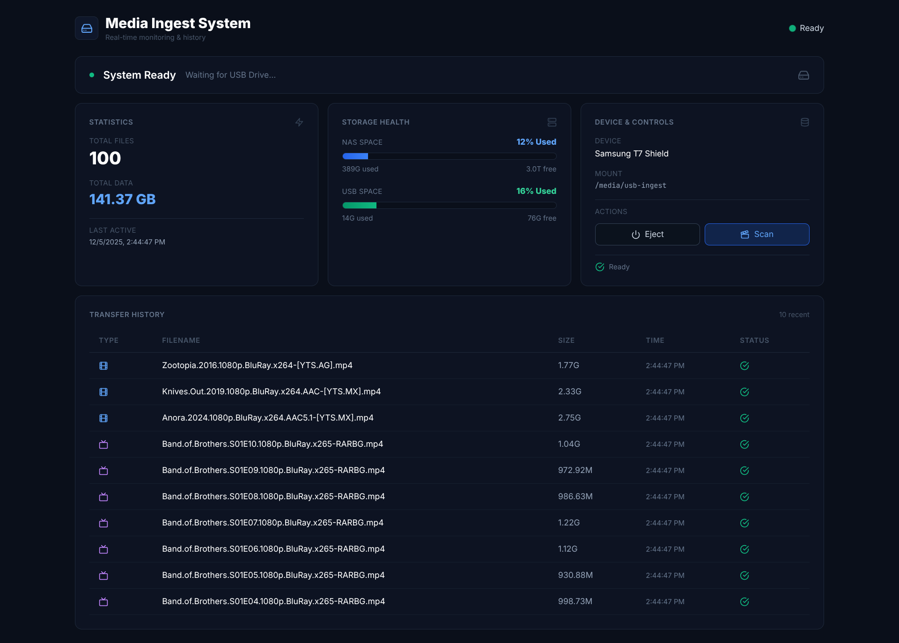
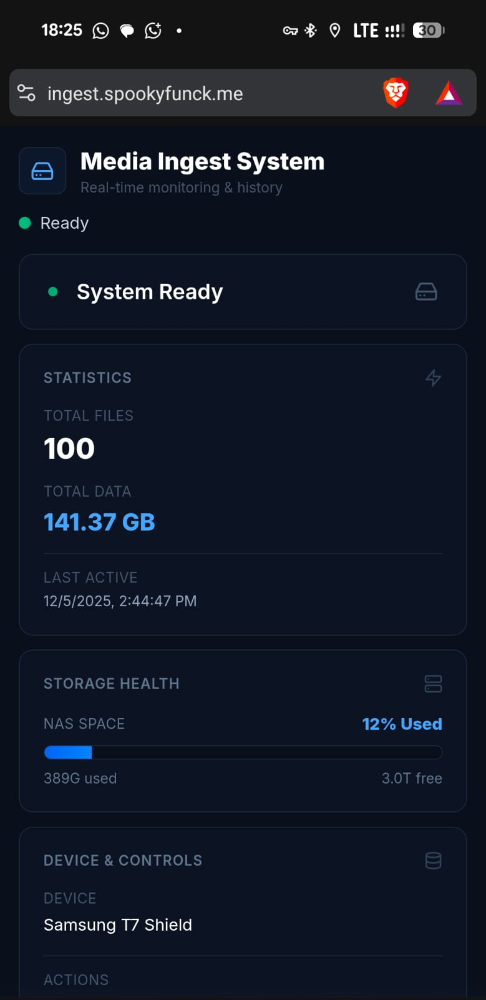

<div align="center">

# 🚀 Proxmox USB Media Ingest Station

**Transform your Proxmox node into an automated media ingest powerhouse**

[](https://opensource.org/licenses/MIT)
[](https://github.com/TheLastDruid/mediaIngest/stargazers)
[](https://github.com/TheLastDruid/mediaIngest/issues)
[](http://makeapullrequest.com)
[](https://github.com/TheLastDruid/mediaIngest)

**Stop manually mounting drives. Turn your Proxmox node into a dedicated Ingest Station.**

[Features](#-features) • [Quick Start](#-quick-start) • [How It Works](#️-how-it-works) • [Screenshots](#-screenshots) • [Contributing](#-contributing)



</div>

---

## 🎯 The Problem

Managing media for self-hosted platforms like **Jellyfin**, **Plex**, or **Emby** shouldn't require:
- Manually mounting USB drives
- Navigating terminal commands
- Tracking sync progress with `rsync` flags
- Dealing with NTFS permissions
- Wondering if files transferred successfully

**This project solves all of that.**

---

## ✨ Features

### 🔌 **Universal Drive Support**
- Automatically detects **any** USB storage device
- High-performance **ntfs3** kernel driver (kernel 5.15+)
- Graceful fallback to **ntfs-3g** for older systems
- No manual mounting required—ever

### 📊 **Real-Time Dashboard**
- **Modern Bento Grid UI** with Framer Motion animations
- **Live progress bars** showing rsync transfer speed
- **Dark mode optimized** for home lab aesthetics
- **Mobile responsive** - monitor from your phone
- **Transfer history** with timestamps and status

### ⚡ **Zero-Touch Automation**
- **Plug & Play**: Insert USB → Auto-mount → Auto-sync → Auto-unmount
- **Intelligent NAS detection** - scans `/mnt/pve/*` and `/mnt/*`
- **Auto-provisions** Media folder with proper permissions
- **Concurrent USB support** - multiple drives at once
- **Smart folder detection** - Movies, Series, Anime (case-insensitive)

### 🏗️ **Production-Grade Architecture**
- **LXC containerization** for isolation and security
- **Privileged container** with bind mounts to NAS
- **systemd service** integration for reliability
- **udev rules** for hardware-level USB detection
- **Comprehensive logging** for debugging

### 🎬 **Jellyfin/Plex Ready**
- Designed for **Jellyfin** media servers
- Compatible with **Plex**, **Emby**, **Kodi**, and more
- Organizes content by type (Movies/Series/Anime)
- Preserves metadata and folder structure
- `--ignore-existing` prevents overwrites

### 🔧 **Developer Friendly**
- **React 18** + **Vite 4** frontend
- **Express 4** backend with WebSocket-like polling
- **Tailwind CSS 3** for styling
- **Framer Motion 10** for animations
- **Single-file installer** - no dependencies on host

---

## 🚀 Quick Start

### Prerequisites

- **Proxmox VE 7.0+** (tested on 8.x)
- **NAS mounted** to `/mnt/pve/*` or `/mnt/*`
- **Internet connection** (for initial template download)
- **Root access** to Proxmox host

### The Magic One-Liner

```bash
bash -c "$(wget -qLO - https://raw.githubusercontent.com/TheLastDruid/mediaIngest/main/install.sh)"
```

**That's it.** The installer will:
1. ✅ Scan your mounted storage and let you select destination
2. ✅ Auto-detect next available container ID
3. ✅ Download Debian 12 template (if needed)
4. ✅ Create privileged LXC container with bind mounts
5. ✅ Deploy React dashboard on port 3000
6. ✅ Configure udev rules for USB detection
7. ✅ Start all services automatically

**Installation time:** 5-10 minutes  
**User interaction:** One menu selection (choose NAS destination)

### Alternative Installation (curl)

```bash
bash -c "$(curl -fsSL https://raw.githubusercontent.com/TheLastDruid/mediaIngest/main/install.sh)"
```

---

## 🛠️ How It Works

<details>
<summary><b>🔍 Click to expand architecture details</b></summary>

### The Pipeline

```
┌─────────────────────────────────────────────────────────────────┐
│ 1. USB DETECTION (Proxmox Host)                                │
│    • udev rule catches: KERNEL=="sd[a-z]"                       │
│    • Triggers: /usr/local/bin/usb-trigger.sh                    │
│    • Mounts to: /mnt/usb-pass (ntfs3 or ntfs-3g)               │
└─────────────────────────────────────────────────────────────────┘
                              ↓
┌─────────────────────────────────────────────────────────────────┐
│ 2. CONTAINER EXECUTION (LXC)                                    │
│    • systemd-run launches: ingest-media.sh                      │
│    • Scans USB for: /Media folder (case-insensitive)           │
│    • Syncs: Movies, Series, Anime folders                       │
└─────────────────────────────────────────────────────────────────┘
                              ↓
┌─────────────────────────────────────────────────────────────────┐
│ 3. REAL-TIME DASHBOARD (React + Express)                        │
│    • Backend polls: /var/log/media-ingest.log                   │
│    • Parses rsync output with: tr '\r' '\n'                    │
│    • Frontend refreshes: Every 2 seconds via fetch()            │
└─────────────────────────────────────────────────────────────────┘
                              ↓
┌─────────────────────────────────────────────────────────────────┐
│ 4. DESTINATION (Your NAS)                                       │
│    • Files land in: $NAS_PATH/Media/{Movies,Series,Anime}      │
│    • Permissions: 777 (configurable)                            │
│    • Jellyfin/Plex auto-detects new content                     │
└─────────────────────────────────────────────────────────────────┘
```

### Security Model

- **Privileged container** required for bind mounts
- **Isolated network** (DHCP, no exposed services outside LAN)
- **Read-only USB access** (syncs don't modify source)
- **No root privileges** needed for dashboard access
- **systemd sandboxing** for ingest script

### Why This Approach?

✅ **Hardware-level detection** - udev rules never miss a device  
✅ **Container isolation** - dashboard crashes don't affect Proxmox  
✅ **Scalable** - handles multiple USBs with unique systemd units  
✅ **Debuggable** - comprehensive logs at every stage  
✅ **Maintainable** - single bash script installer  

</details>

---

## ⚙️ Configuration

### Change NAS Destination

After installation, edit the LXC container's bind mount:

```bash
# Method 1: Reinstall (recommended)
pct destroy [CT_ID]
bash -c "$(wget -qLO - https://raw.githubusercontent.com/TheLastDruid/mediaIngest/main/install.sh)"
# Select different destination from menu

# Method 2: Manual edit
pct set [CT_ID] -mp1 /mnt/pve/NEW_NAS_PATH,mp=/media/nas
pct reboot [CT_ID]
```

### Add Custom Folders

Edit `/usr/local/bin/ingest-media.sh` inside container:

```bash
pct enter [CT_ID]
nano /usr/local/bin/ingest-media.sh

# Add at the end (before "Ingest Complete"):
sync_folder "Documentaries"
sync_folder "Music"
sync_folder "Photos"
```

### Change Dashboard Port

```bash
pct enter [CT_ID]
nano /etc/systemd/system/mediaingest-dashboard.service

# Add under [Service]:
Environment="PORT=8080"

systemctl daemon-reload
systemctl restart mediaingest-dashboard
```

### Modify rsync Flags

Default: `-rvh -W --inplace --progress --ignore-existing`

```bash
pct enter [CT_ID]
nano /usr/local/bin/ingest-media.sh

# Change rsync line to:
rsync -rvhz -W --inplace --progress --ignore-existing  # Add compression
rsync -rvhc -W --inplace --progress --ignore-existing  # Add checksums
```

---

## 📸 Screenshots

### Desktop View

*Full-featured Bento Grid dashboard with statistics, storage health, device controls, and transfer history*

### Mobile View


*Fully responsive mobile interface - monitor transfers from anywhere*

### Key Features Shown
- ✅ Real-time transfer statistics (100 files, 141.37 GB transferred)
- ✅ Storage health monitoring (NAS 12% used, USB 16% used)
- ✅ Device controls (Samsung T7 Shield detected with Eject/Scan buttons)
- ✅ Complete transfer history with timestamps and status indicators
- ✅ Dark mode optimized UI with modern Bento Grid layout
- ✅ Smooth animations and professional design

---

## 🧪 Testing & Validation

### Test USB Detection

```bash
# Monitor udev events
udevadm monitor --environment --udev

# Insert USB and check logs
tail -f /var/log/usb-ingest.log
```

### Test Ingest Script Manually

```bash
# Simulate USB insertion
/usr/local/bin/usb-trigger.sh /dev/sdX

# Or inside container
pct enter [CT_ID]
/usr/local/bin/ingest-media.sh
```

### Check Dashboard Health

```bash
# Service status
pct exec [CT_ID] -- systemctl status mediaingest-dashboard

# Live logs
pct exec [CT_ID] -- journalctl -u mediaingest-dashboard -f

# Network check
pct exec [CT_ID] -- netstat -tlnp | grep 3000
```

---

## 🤝 Contributing

We welcome contributions from the community! Whether it's:

- 🐛 **Bug reports** - Found an issue? [Open an issue](https://github.com/TheLastDruid/mediaIngest/issues)
- 💡 **Feature requests** - Have an idea? [Start a discussion](https://github.com/TheLastDruid/mediaIngest/discussions)
- 🔧 **Pull requests** - Want to contribute code? See [CONTRIBUTING.md](CONTRIBUTING.md)
- 📚 **Documentation** - Improve the docs or add examples
- ⭐ **Star the repo** - Show your support!

### Development Setup

```bash
# Clone repository
git clone https://github.com/TheLastDruid/mediaIngest.git
cd mediaIngest

# Backend
npm install
npm start  # Port 3000

# Frontend (separate terminal)
cd client
npm install
npm run dev  # Port 5173
```

### Contribution Workflow

1. Fork the repository
2. Create a feature branch (`git checkout -b feature/AmazingFeature`)
3. Commit your changes (`git commit -m 'Add some AmazingFeature'`)
4. Push to the branch (`git push origin feature/AmazingFeature`)
5. Open a Pull Request

See [CONTRIBUTING.md](CONTRIBUTING.md) for detailed guidelines.

---

## 🛡️ Security

This project takes security seriously. If you discover a security vulnerability:

1. **DO NOT** open a public issue
2. Email: [Create a private security advisory](https://github.com/TheLastDruid/mediaIngest/security/advisories/new)
3. Include: Description, steps to reproduce, potential impact

See [SECURITY.md](SECURITY.md) for our full security policy.

---

## 📜 License

This project is licensed under the **MIT License** - see the [LICENSE](LICENSE) file for details.

```
Copyright (c) 2025 Spookyfunck

Permission is hereby granted, free of charge, to any person obtaining a copy
of this software and associated documentation files (the "Software"), to deal
in the Software without restriction...
```

---

## 🙏 Acknowledgments

- **tteck** - For inspiration from [Proxmox VE Helper-Scripts](https://tteck.github.io/Proxmox/)
- **Proxmox Team** - For the amazing virtualization platform
- **React & Vite** - For the modern frontend tooling
- **Framer Motion** - For beautiful animations
- **Tailwind CSS** - For rapid UI development
- **AI Assistance** - Frontend UI was vibe-coded with AI pair programming
- **Home Lab Community** - For testing and feedback

---

## 📬 Support & Community

- 🐛 **Bug Reports**: [GitHub Issues](https://github.com/TheLastDruid/mediaIngest/issues)
- 💬 **Discussions**: [GitHub Discussions](https://github.com/TheLastDruid/mediaIngest/discussions)
- 📖 **Documentation**: [Full Docs](DEPLOYMENT_GUIDE.md)
- 👨‍💻 **Developer**: [Spookyfunck](https://github.com/TheLastDruid)

---

## 🗺️ Roadmap

- [ ] **v3.1** - Multi-language support (i18n)
- [ ] **v3.2** - Docker version for non-Proxmox users
- [ ] **v3.3** - Plex/Jellyfin API integration (auto-scan)
- [ ] **v3.4** - Mobile app (React Native)
- [ ] **v4.0** - Cloud storage sync (S3, Backblaze B2)
- [ ] **v4.1** - Automatic media renaming (TheMovieDB API)
- [ ] **v4.2** - Duplicate detection and deduplication
- [ ] **v5.0** - ARM64 support (Raspberry Pi, Apple Silicon)

Vote on features in [Discussions](https://github.com/TheLastDruid/mediaIngest/discussions)!

---

## 📊 Project Stats


---

<div align="center">

**Made with ❤️ by [Spookyfunck](https://github.com/TheLastDruid)**

**If this project saved you time, consider giving it a ⭐!**

[⬆ Back to Top](#-proxmox-usb-media-ingest-station)

</div>
